# Projet-PPS

# Dispositif de mesure de la qualité de l'eau d'un lac ou d'une rivière avec géolocalisation connecté à internet (Cloud)

## Contexte et origine
Notre entreprise se spécialise dans la fabrication de dispositifs de mesure pour évaluer la qualité de l'eau des lacs et des rivières. Traditionnellement, nos équipes se déplacent sur des embarcations pour effectuer des relevés sur place et collecter des échantillons destinés à des analyses en laboratoire. Chaque mesure inclut des données sur la date, l'heure, la température, la position géographique et l'échantillon d'eau, le tout consigné sur support papier. Un employé a eu l'idée novatrice de créer un dispositif qui réaliserait les relevés et l'enregistrement des données automatiquement, sans avoir besoin de notes papier ni d'échantillons. Ce dispositif permettrait de mesurer la qualité de l’eau en temps réel et d’envoyer instantanément les données à nos bases de données pour être visualisées sur une carte Google Maps, offrant ainsi une accessibilité à jour pour tous.

Afin de concrétiser cette vision et de poursuivre notre engagement envers la santé environnementale, nous avons décidé de développer et de commercialiser ce produit, qui remplacera nos procédés actuels.

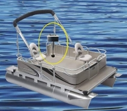

## Besoin général
Le dispositif requis est un système de mesure de la qualité de l'eau capable de collecter et de transmettre des données concernant la concentration de certains gaz (tels que l'oxygène) et la température de l'eau. Il doit inclure la géolocalisation, le niveau de batterie, ainsi que l'envoi des données à une plateforme cloud via le réseau LoRaWAN. Les données devront être affichées sur une carte Google Maps.

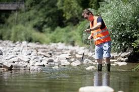

## Objectifs
- Concevoir un dispositif capable de mesurer la qualité de l'eau
- Transmettre les données recueillies à une plateforme cloud accessible aux employés
- Afficher les données de qualité de l'eau sur une carte Google Maps en temps réel
- Fonctions principales

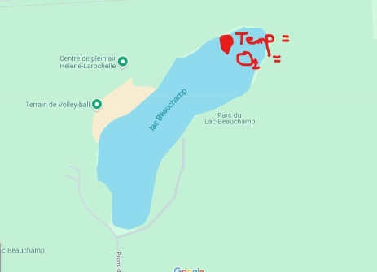

## Le dispositif peux
- Mesurer la concentration d’oxygène (O2) dans l’eau
- Mesurer la température de l'eau
- Fournir des données de géolocalisation (latitude et longitude), ainsi que la date et l’heure de la mesure
- Indiquer la tension et le niveau de la batterie
- Envoyer les données recueillies via le réseau LoRaWAN à une plateforme cloud (ThingsBoard)
- Mettre à jour les données toutes les 5 minutes
- Afficher les données collectées sur une carte Google Maps intégrée à la plateforme ThingsBoard

## Composants nécessaires (images)
- Maduino Zero LoRaWAN
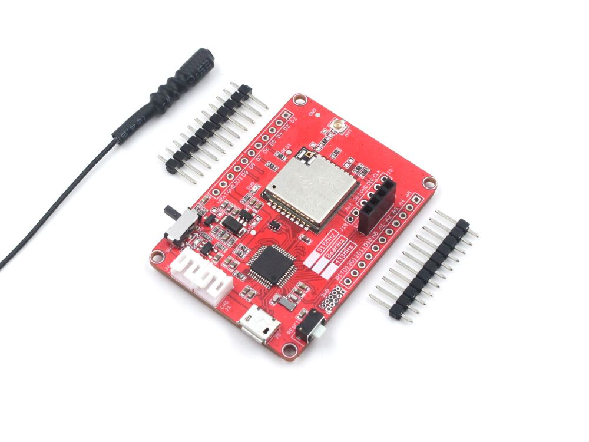

- Capteur de température 1-WIRE hydrofuge (5V)
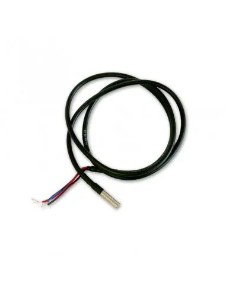

- Capteur de concentration d’oxygène hydrofuge (5V)
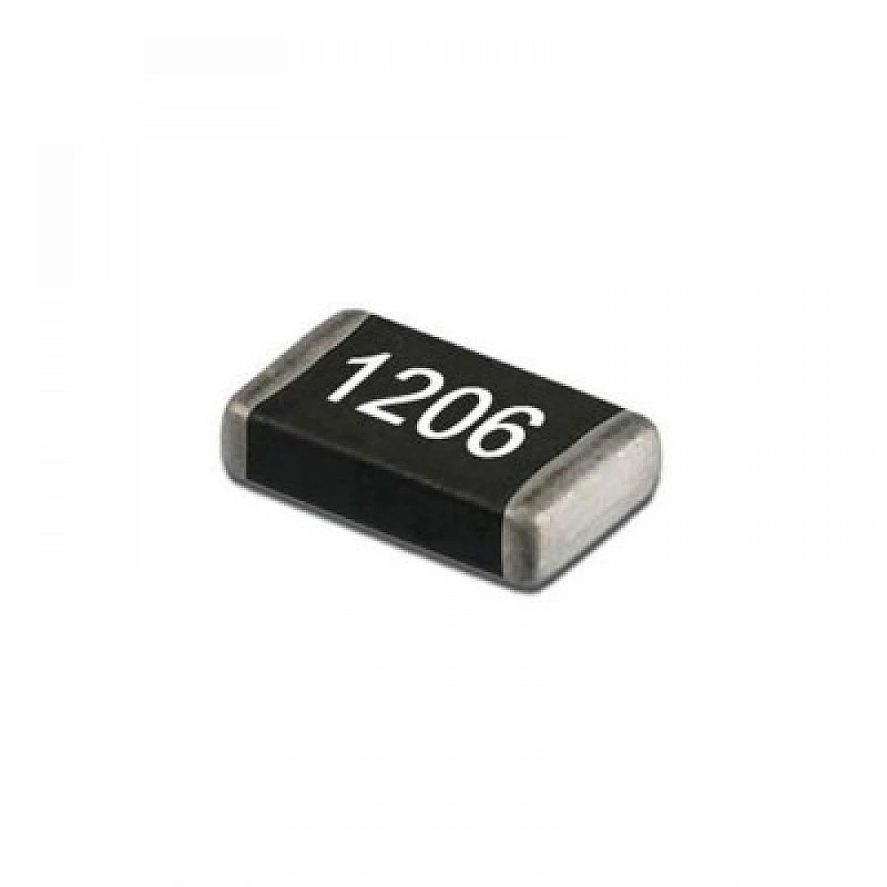

- Une résistance de 1K Ohm 1206

- 2 piles AA de 1.5V chacune
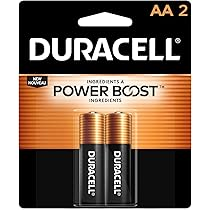

- Un support pour 2 piles AA
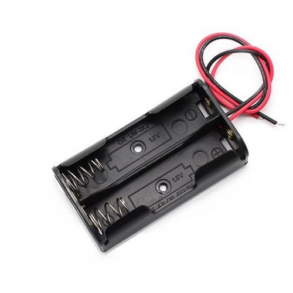

- Un interrupteur marche/arrêt pour contrôler l’alimentation
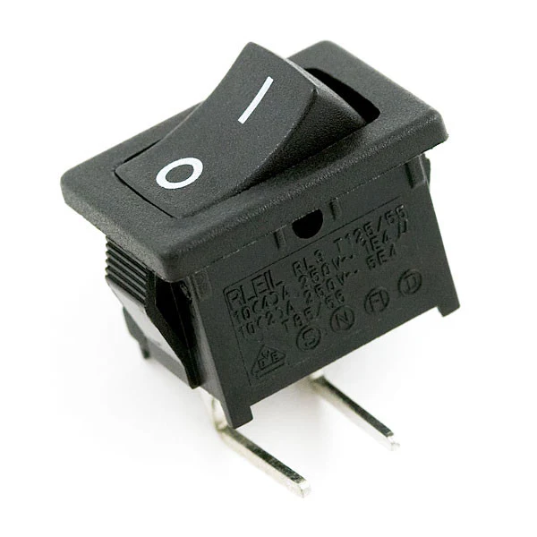

- Un convertisseur élévateur ***boost*** de 3.3V à 5V

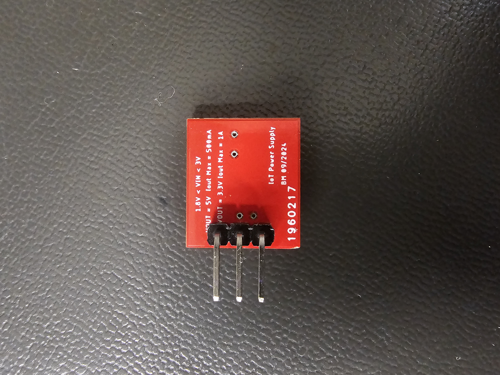

*Voir la catégorie **Liens d'achat de ce projet** pour les liens d'achat*

## Conclusion
Ce projet vise à révolutionner la manière dont nous mesurons et suivons la qualité de l'eau des lacs et des rivières. Grâce à ce dispositif, nous pourrons fournir des données précises, instantanées et accessibles à toute notre équipe, tout en assurant un suivi environnemental amélioré.

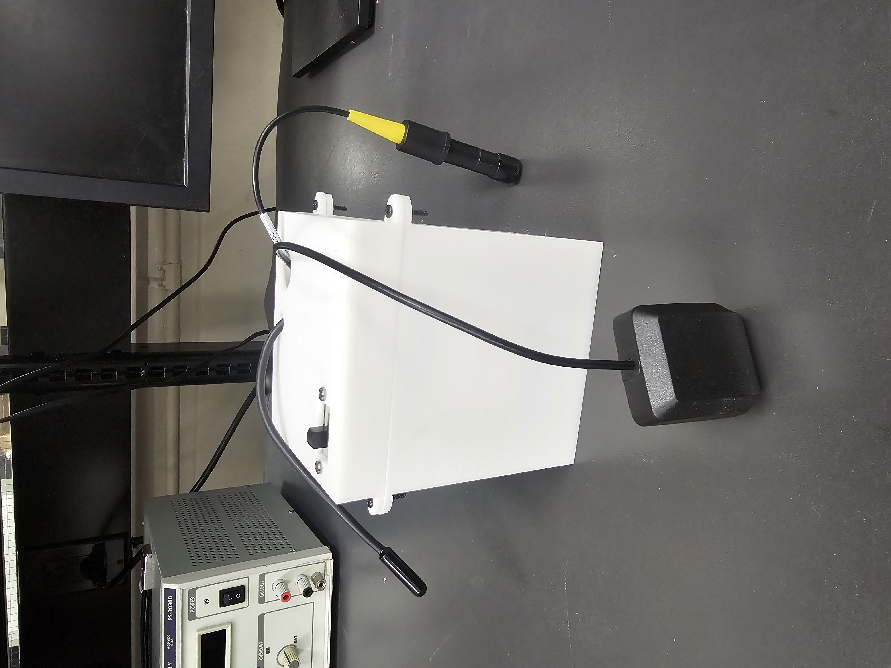

*Représentation de l'assemblage du projet*

# Version des fichiers fonctionnel pout ce projet
- /Codes/CodeV1.2 ---> **PPSV1.2.ino***
- /Impressions3D/Boiter3DV1.1 ---> **PPS_Boitier.stl** et **PPS_CouvercleBoitier.stl**
- /Schématiques/CircuitV1.3 ---> **PPS_schematic.sch**
- /Schématiques/MatricielV1.3 ---> **PPS_schematic.brd**

# Problèmes rencontrés
Voir /Liste_des_problèmes ---> Liste_problemes_PPS.xlsx

# Liens d'achat de ce projet
Voir /Liste_des_composants ---> Liste_composants_PPS.xlsx

# Liens d'information supplémentaire
- [CayenneLPP](https://github.com/myDevicesIoT/CayenneLPP)
- [Arduino LoRaWAN Device Library](https://github.com/TheThingsNetwork/arduino-device-lib)
- [ASR650X AT Command Introduction](https://www.hoperf.com/data/upload/back/20190605/ASR650X%20AT%20Command%20Introduction-20190605.pdf)
- [Maduino Zero LoRaWAN](https://github.com/Makerfabs/Maduino-Zero-Lorawan/tree/Ra07)
- [Github chirpstack docker](https://github.com/chirpstack/chirpstack-docker)
- [Documentation ChirpStack](https://www.chirpstack.io/docs/)
- [Documentation ThingsBoard](https://thingsboard.io/)
